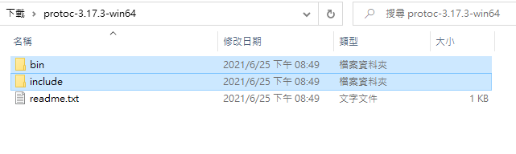
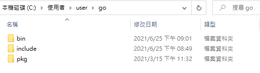

# 使用 gRPC 需安裝的相關東西

- 安裝 compiler

  [依照 OS 安裝](https://github.com/protocolbuffers/protobuf/releases)

  把解壓縮後的資料夾放到 `C:\Users\user\go`

  

  1. bin 裡面的 `protoc.exe` 放到 `C:\Users\user\go\bin` 裡面

  2. `include 資料夾`直接拉過去

  

  確認有成功安裝

  ```powershell
  protoc --version
  ```

- 安裝 protoc-gen-go

  才可以將 proto buffer 編譯成 Golang 可使用的檔案

  ```powershell
  go get github.com/golang/protobuf/protoc-gen-go
  ```

- 安裝 gRPC

  才可以在 Golang 中使用 gRPC

  ```powershell
  go get -u google.golang.org/grpc
  ```
