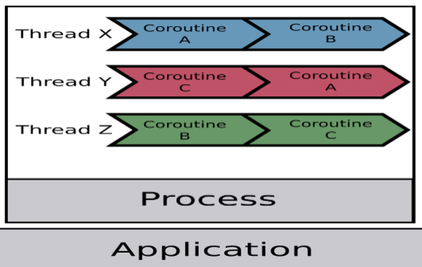
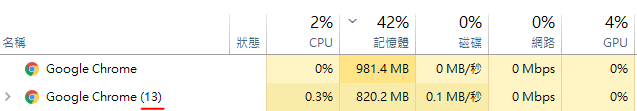

# Process & Thread & Coroutine

## Process

- process 指的就是執行中的程式的一個實例，實例指的是 OS 分配資源的基本單位
- 後面的數字代表有幾個實例，每個實例就是一個 process

- process 對 OS 來說就是一個任務
- 每個 process 有獨立的 address

### Process & Program 差別

- program 就是寫好的 code，program 執行後就變成 process

### Process 優缺點

- Pros
  每個 process 都有獨立的資源，之間不容易互相影響
- Cons
  process 的建立及 context switch 開銷大

## Thread

- light weight process (輕量化的 process)
- 一個 process 裡面至少會有一個 thread
- 一個 process 裡面的 thread 會共享資源
- 是 OS 分配 CPU 時間的對象

### Multi Thread

- 一個 process 內有多個 thread，分配給多核心，達到 parallel
- 需考慮 race condition (因為共享資源)

## Coroutine

- 用戶態的輕量級 thread，調度由用戶控制
- 一個 thread 裡面至少會有一個 coroutine

### Coroutine vs Thread

- coroutine 只需 `KB` 就能建立，thread 則需 `MB` 記憶體
- coroutine 的 context switch 開銷低、速度快

## Reference

[進程 (Process)、線程 (Thread)、協程 (Coroutine) 的概念講解](https://blog.kennycoder.io/2020/05/16/%E9%80%B2%E7%A8%8B-Process-%E3%80%81%E7%B7%9A%E7%A8%8B-Thread-%E3%80%81%E5%8D%94%E7%A8%8B-Coroutine-%E7%9A%84%E6%A6%82%E5%BF%B5%E8%AC%9B%E8%A7%A3/)
